# Contributing to ProseFlow

First off, thank you for considering contributing to ProseFlow! 🎉

We're thrilled that you're interested in helping us build the best writing assistant. Every contribution, from a small bug fix to a major new feature, is valuable and greatly appreciated.

This document provides guidelines for contributing to the project to ensure a smooth and effective process for everyone involved. Please read it carefully to ensure a smooth and effective collaboration process.

## Table of Contents

1.  [Code of Conduct](#code-of-conduct)
2.  [How Can I Contribute?](#how-can-i-contribute)
3.  [Development Setup](#development-setup)
    *   [Prerequisites](#prerequisites)
    *   [Steps to Run](#steps-to-run)
4.  [Understanding the Architecture](#understanding-the-architecture)
5.  [Coding Style & Conventions](#coding-style--conventions)
6.  [Submitting a Pull Request](#submitting-a-pull-request)
7.  [Where to Find Things (A Guided Tour)](#where-to-find-things)

## Code of Conduct

We are committed to providing a friendly, safe, privacy-focused, and open-source software for all. By participating in this project, you agree to abide by our Code of Conduct. Please be respectful and considerate in all your interactions. Harassment or exclusionary behavior will not be tolerated.

## How Can I Contribute?

There are many ways to contribute to ProseFlow:

*   **Reporting Bugs:** If you find a bug, please create an issue in our GitHub repository. Describe the bug clearly, include steps to reproduce it, and mention your operating system and the app version.
*   **Suggesting Enhancements:** Have an idea for a new feature or a UX improvement? Open an issue to discuss it. We love hearing new ideas!
*   **Writing Code:** Help us fix bugs or implement new features. If you're looking for a place to start, check the [Issues tab](https://github.com/LSXPrime/ProseFlow/issues) and look for issues tagged with `good first issue` or `help wanted`.
*   **Improving Documentation:** Clear documentation is crucial. If you find parts of our documentation (including this guide!) that could be improved, feel free to submit a pull request.

## Development Setup

To get ProseFlow running on your local machine, follow these steps.

### Prerequisites

Before you begin, make sure you have the following tools installed:

*   [.NET 8 SDK](https://dotnet.microsoft.com/download/dotnet/8.0)
*   [Git](https://git-scm.com/)
*   An IDE of your choice:
    *   [Visual Studio 2022](https://visualstudio.microsoft.com/) (Windows)
    *   [JetBrains Rider](https://www.jetbrains.com/rider/) (Recommended for cross-platform development)
    *   [Visual Studio Code](https://code.visualstudio.com/) with the C# Dev Kit and Avalonia extensions.

### Steps to Run

1.  **Fork and Clone the Repository:**
    ```bash
    git clone https://github.com/LSXPrime/ProseFlow.git
    cd ProseFlow
    ```

2.  **Restore Workloads:**
    Since this project is deploying to multiple platforms, we need to restore the workloads.
    ```bash
    dotnet workload restore
    ```

3.  **Restore Dependencies:**
    The first time you open the solution (`ProseFlow.sln`) in your IDE, it should automatically restore all NuGet packages. You can also do this manually from the command line:
    ```bash
    dotnet restore
    ```

4.  **Set up the Database:**
    ProseFlow uses Entity Framework Core with a SQLite database. The database file (`proseflow.db`) is created automatically. You just need to apply the migrations.

    *   Ensure you have the EF Core tools installed: `dotnet tool install --global dotnet-ef`
    *   From the root of the repository, run the following command to apply migrations:
    ```bash
    dotnet ef database update --startup-project ProseFlow.UI
    ```
    This will create and seed the database in the appropriate application data folder for your OS. The application uses a local SQLite database, which will be created and migrated automatically in your user's `AppData` or equivalent folder on its first run.

5.  **Build and Run the Application:**
    *   The main UI project is `ProseFlow.UI`. You can run it from your IDE by setting it as the startup project and then building/running.
    *   Alternatively, via the command line:
    ```bash
    dotnet run --project ProseFlow.UI/ProseFlow.UI.csproj
    ```
    The application should launch, and you will be greeted with the first-run onboarding window if the database was just created.

## Understanding the Architecture

ProseFlow is built using **Clean Architecture** principles to ensure separation of concerns, maintainability, and testability. The solution is divided into four main projects. This approach ensures that dependencies flow inwards, from the outer layers (UI, Infrastructure) to the inner layers (Application, Core).

```mermaid
graph TD
    %% Define styles for different component types
    classDef layer fill:#f9f9f9,stroke:#333,stroke-width:2px;
    classDef interface fill:#e6f3ff,stroke:#0066cc;
    classDef concrete fill:#d4edda,stroke:#155724;
    classDef ui fill:#f8d7da,stroke:#721c24;
    classDef external fill:#fff3cd,stroke:#856404;

    %% --- External Libraries ---
    subgraph External_Libraries["External Libraries"]
        LlmTornado[LlmTornado]:::external
        LLamaSharp[LLamaSharp]:::external
        EFCore[Entity Framework Core]:::external
        Avalonia[Avalonia UI]:::external
        SharpHook[SharpHook]:::external
    end

    %% --- Core Layer ---
    subgraph Core["Core (ProseFlow.Core)"]
        direction TB
        Core_Interfaces["Interfaces (IAiProvider, IRepository, IUnitOfWork)"]:::interface
        Core_Models["Models (Action, HistoryEntry, etc.)"]:::concrete
        Enums[Enums]:::concrete
    end
    class Core layer

    %% --- Application Layer ---
    subgraph Application["Application (ProseFlow.Application)"]
        direction TB
        App_Interfaces["Interfaces (IDownloadManager, IUpdateService)"]:::interface
        App_Services["Services (ActionOrchestrationService, etc.)"]:::concrete
        DTOs["DTOs (ActionDto, etc.)"]:::concrete
        AppEvents["AppEvents (Static Events)"]:::concrete
    end
    class Application layer

    %% --- Infrastructure Layer ---
    subgraph Infrastructure["Infrastructure (ProseFlow.Infrastructure)"]
        direction TB
        subgraph Data_Access["Data Access"]
            AppDbContext[AppDbContext]:::concrete
            Repositories["Repositories (ActionRepository, etc.)"]:::concrete
        end
        subgraph AI_Providers["AI Providers"]
            CloudProvider[CloudProvider]:::concrete
            LocalProvider[LocalProvider]:::concrete
        end
        subgraph OS_Services["OS Services"]
            OsService[OsService]:::concrete
            ActiveWindowTrackers["Platform-Specific Trackers"]:::concrete
        end
        ApiKeyProtector["Security (ApiKeyProtector)"]:::concrete
    end
    class Infrastructure layer

    %% --- UI Layer ---
    subgraph UI["UI (ProseFlow.UI)"]
        direction TB
        DI_Setup["Dependency Injection Setup (App.axaml.cs)"]:::ui
        ViewModels["ViewModels (MVVM)"]:::ui
        Views["Views (.axaml)"]:::ui
        Services_UI["UI Services (DialogService, etc.)"]:::ui
    end
    class UI layer

    %% --- Dependency Relationships ---

    %% UI Layer Dependencies
    Views -- "Binds to" --> ViewModels
    ViewModels -- "Uses" --> App_Services
    Services_UI -- "Used by" --> Views
    Services_UI -- "Used by" --> ViewModels
    DI_Setup -- "Registers" --> App_Services
    DI_Setup -- "Registers" --> Repositories
    DI_Setup -- "Registers" --> CloudProvider
    DI_Setup -- "Registers" --> LocalProvider
    DI_Setup -- "Registers" --> OsService
    UI -- "Built with" --> Avalonia

    %% Infrastructure Layer Dependencies
    Repositories -- "Implements" --> Core_Interfaces
    CloudProvider -- "Implements" --> Core_Interfaces
    LocalProvider -- "Implements" --> Core_Interfaces
    OsService -- "Implements" --> Core_Interfaces
    ApiKeyProtector -- "Implements" --> App_Interfaces
    Repositories -- "Uses" --> AppDbContext
    AppDbContext -- "Uses" --> EFCore
    CloudProvider -- "Uses" --> LlmTornado
    LocalProvider -- "Uses" --> LLamaSharp
    OsService -- "Uses" --> SharpHook
    ActiveWindowTrackers -- "Used by" --> OsService

    %% Application Layer Dependencies
    App_Services -- "Depends on" --> Core_Interfaces
    App_Services -- "Uses" --> Core_Models
    App_Services -- "Uses" --> DTOs
    App_Services -- "Raises" --> AppEvents
    App_Services -- "Implements" --> App_Interfaces

    %% Cross-layer Dependencies
    ViewModels -- "Listens to" --> AppEvents
    Infrastructure -- "Provides implementations for" --> Application
    Infrastructure -- "Provides implementations for" --> Core
    Application -- "Depends on abstractions from" --> Core
    UI -- "Depends on" --> Application

    %% Architecture Flow
    UI --> Application
    Application --> Core
    Infrastructure --> Core
    Infrastructure --> Application
```



#### 📂 `ProseFlow.Core`
This is the heart of the application. It contains the core domain models, business logic, and interfaces.
*   **Models:** Plain C# objects representing the core concepts (e.g., `Action`, `HistoryEntry`, `CloudProviderConfiguration`).
*   **Enums:** Application-wide enumerations.
*   **Interfaces:** Contracts for repositories (`IRepository`, `IActionRepository`) and core services (e.g., `IUnitOfWork`, `IAiProvider`, `IOsService`).
*   **Key Rule:** This project has **zero dependencies** on other layers or external frameworks.

#### 📂 `ProseFlow.Application`
This layer contains the application-specific business rules and orchestrates the core domain models.
*   **Services:** Classes that implement the application's use cases (e.g., `ActionOrchestrationService`, `DashboardService`). They depend on interfaces from `ProseFlow.Core`.
*   **DTOs (Data Transfer Objects):** Simple records used to transfer data between layers, especially to and from the UI.
*   **Interfaces:** Defines interfaces for infrastructure components that the application logic needs (e.g., `IDownloadManager`, `IUpdateService`).
*   **Events:** Static events (`AppEvents`) for decoupled communication between the application layer and the UI.
*   **Key Rule:** Depends only on `ProseFlow.Core`. It does not know about specific UI frameworks or infrastructure details.

#### 📂 `ProseFlow.Infrastructure`
This is the outermost layer that provides concrete implementations for the interfaces defined in the `Application` and `Core` layers.
*   **Data:** Contains the `AppDbContext` (Entity Framework Core), repository implementations, and the `UnitOfWork` pattern for database transactions.
*   **Services:** Home to implementations that interact with the outside world:
    *   `AiProviders`: Concrete `IAiProvider` implementations for both **Cloud** (using `LlmTornado`) and **Local** (using `LLamaSharp`) models.
    *   `Os`: Platform-specific services for hotkeys (`SharpHook`) and active window tracking.
    *   `Security`: `ApiKeyProtector` for encrypting sensitive data.
*   **Key Rule:** Depends on `ProseFlow.Application` and `ProseFlow.Core`. This is where all external libraries and platform-specific code reside.

#### 📂 `ProseFlow.UI`
The presentation layer, built with **Avalonia UI** and following the **MVVM (Model-View-ViewModel)** pattern.
*   **Views:** The XAML files that define the user interface (`.axaml`). They are kept as simple as possible, with minimal code-behind.
*   **ViewModels:** The logic that drives the Views. They are responsible for state management and user interaction commands. We use the **CommunityToolkit.Mvvm** library. ViewModels should inherit from `ViewModelBase`.
*   **Models:** UI-specific models or DTOs.
*   **Services:** UI-specific services like `DialogService` and `NotificationService`.
*   **Behaviors & Converters:** Reusable components that extend Avalonia's functionality.
*   **Key Rule:** Depends on `ProseFlow.Application` and `ProseFlow.Infrastructure`. It wires up all the dependencies in `App.axaml.cs` using `Microsoft.Extensions.DependencyInjection`.

**Key Design Patterns:**
*   **Dependency Injection:** Services are registered in `App.axaml.cs` and injected via constructors throughout the application. Prefer constructor injection.
*   **Repository & Unit of Work:** Decouples business logic from data access.
*   **Async/Await:** All I/O and long-running operations are asynchronous using `async Task`. Suffix all `async` methods with `Async` (e.g., `LoadSettingsAsync`). Avoid `async void` except for event handlers.

## Coding Style & Conventions

Consistency is key. Please adhere to the following conventions:

*   **Language:** We use C# 12 and .NET 8. Feel free to use modern language features where appropriate (e.g., file-scoped namespaces, primary constructors, `record` types for DTOs).
*   **Formatting:** We follow standard .NET coding conventions
*   **MVVM:** We use the `CommunityToolkit.Mvvm` library.
    *   Use `[ObservableProperty]` for properties that need to notify the UI.
    *   Use `[RelayCommand]` for methods that will be bound to UI commands (e.g., button clicks).
    *   Keep Views free of business logic.
*   **Naming:**
    *   Use `PascalCase` for classes, methods, properties, and enums.
    *   Use `_camelCase` for private fields.
    *   UI controls in XAML should have a meaningful `x:Name`.
*   **Comments:**
    *   Write XML documentation (`/// <summary>...`) for all public methods, properties, and classes. This helps with IntelliSense and maintainability.
    *   Use `//` for inline comments to clarify complex or non-obvious logic within a method.
*   **XAML:**
    *   Use `StaticResource` for converters, styles, and brushes to promote reusability.
    *   Follow the existing structure and organization within View files.
    *   Our UI is built on the **ShadUI** theme for Avalonia. Please use its components (`Card`, `Button` classes, etc.) where appropriate to maintain a consistent look and feel.

## Submitting a Pull Request

Before you submit your PR, please ensure you have completed the following:

1.  **Fork the repository** on GitHub.
2.  **Create a new branch** for your changes from the `master` branch. Name it descriptively, like `fix/hotkey-conflict` or `feat/diff-view` (e.g., `git checkout -b feature/add-new-provider` or `git checkout -b fix/history-view-crash`).
3.  **Make your changes.** Ensure your code adheres to the architecture and coding style outlined above.
4.  **Commit your changes** with a clear and concise commit message.
5.  **Push your branch** to your fork.
6.  **Open a Pull Request (PR)** against the `master` branch of the official repository.

When opening your PR, please ensure:

-   [ ] The project builds and runs without errors.
-   [ ] Your code follows the style guidelines outlined above.
-   [ ] You have added XML comments to any new public members.
-   [ ] Your commit messages are clear and descriptive.
-   [ ] You have written a clear description for your PR, explaining the "what" and "why" of your changes.
-   [ ] You have linked the PR to any relevant issues (e.g., `Fixes #123` or "Closes #123").
-   [ ] You have tested your changes in single or multiple environments.

Once your PR is submitted, a team member will review it. We may suggest some changes or improvements. We appreciate your patience and collaboration during this process.

## Where to Find Things

Here are some common contribution scenarios and where to look in the code:

#### Adding a New Cloud AI Provider

1.  **Core:** Add a new value to the `ProviderType` enum in `ProseFlow.Core/Enums/ProviderType.cs`.
2.  **Infrastructure:** In `CloudProvider.cs`, map your new `ProviderType` to the corresponding `LlmTornado` provider.
3.  **UI:** Add the new provider type to the UI dropdown in `CloudProviderEditorView.axaml`.

#### Implementing a New UI Page

1.  **Application:** Create a new ViewModel (e.g., `MyNewPageViewModel.cs`) that implements the `IPageViewModel` interface from `ViewModelBase.cs`.
2.  **UI:** Create a corresponding View (`MyNewPageView.axaml`) in the `Views` folder.
3.  **Wiring Up:**
    *   Register your new ViewModel in `App.axaml.cs` (`services.AddTransient<MyNewPageViewModel>()`).
    *   Add an instance of your ViewModel to the `PageViewModels` collection in `MainViewModel.cs`.
    *   The `ViewLocator.cs` will automatically connect the View and ViewModel at runtime.

#### Adding a New General Setting

1.  **Core:** Add the property to `GeneralSettings.cs`.
2.  **Infrastructure:** Create a new migration for the database change (`dotnet ef migrations add [MigrationName] -p ProseFlow.Infrastructure -s ProseFlow.UI`).
3.  **UI:**
    *   Add a control to `SettingsView.axaml` and bind it to your new property (e.g., `{Binding Settings.MyNewSetting}`).
    *   The `SettingsViewModel` already loads and saves the entire `GeneralSettings` object, so no ViewModel changes may be needed for simple properties.

---

Thank you again for your interest in contributing to ProseFlow! We look forward to your pull requests. Happy coding!